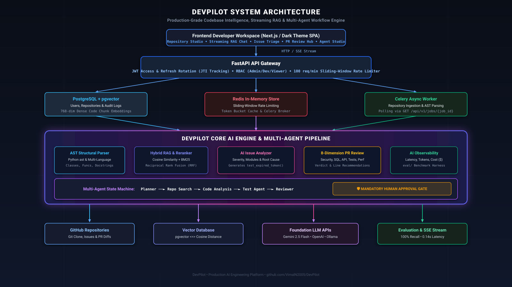

# DevPilot

> **Production-grade AI Backend for Codebase Intelligence & Developer Automation**

[](https://fastapi.tiangolo.com)
[](https://github.com/astral-sh/uv)
[](https://github.com/pgvector/pgvector)
[]()
[]()

---

## What is DevPilot?

As codebases scale across hundreds of files and microservices, onboarding developers, triaging regressions, and reviewing complex pull requests become major bottlenecks. Generic LLM chat wrappers fail because they hallucinate, lack structural understanding of code syntax, and offer no safety guardrails.

**DevPilot** is an autonomous AI Engineering platform that ingests your repository, performs AST-aware code chunking, indexes symbols into vector storage, and delivers:
- **Streaming Architectural RAG**: Real-time Q&A with exact line-level citations via Server-Sent Events (SSE).
- **Automated Issue Triage**: Classifies severity, isolates implicated modules, and generates reproduction tests.
- **8-Dimension PR Review Agent**: Scans pull requests for security vulnerabilities, SQL anti-patterns, and missing tests.
- **Multi-Agent Orchestration**: Sequential state machine (Planner → Search → Analysis → Test → Reviewer) with a strict **Human Approval Gate** before code changes can be applied.
- **Continuous AI Evaluation & Observability**: Built-in benchmark harness (`eval/`) measuring Faithfulness, Recall, Relevance, and Latency alongside real-time token/cost telemetry.

---

## Architecture

<p align="center">
  
</p>

```
                    ┌─────────────────────────┐
                    │  Developer Web UI / IDE │
                    │   Modern Dark Dashboard │
                    └────────────┬────────────┘
                                 │ HTTP / SSE Stream
                                 ▼
                    ┌─────────────────────────┐
                    │     FastAPI Gateway     │
                    │ • JWT Refresh Rotation  │
                    │ • RBAC (Admin/Dev/View) │
                    │ • 100 req/min Limiter   │
                    └────────────┬────────────┘
                                 │
             ┌───────────────────┼───────────────────┐
             ▼                   ▼                   ▼
      ┌─────────────┐     ┌─────────────┐     ┌──────────────┐
      │ PostgreSQL  │     │ Redis Store │     │ Celery Queue │
      │  pgvector   │     │ Rate Limit  │     │ Background   │
      │ Code Chunks │     │ Caching     │     │ Ingestion    │
      └──────┬──────┘     └─────────────┘     └──────┬───────┘
             │                                       │
             └───────────────────┬───────────────────┘
                                 ▼
                     ┌───────────────────────┐
                     │      AI Pipeline      │
                     │ • AST Code Parser     │
                     │ • Dense Embedding     │
                     │ • Hybrid Reranker     │
                     │ • Multi-Agent Studio  │
                     │ • Telemetry Collector │
                     └───────────┬───────────┘
                                 │
             ┌───────────────────┼───────────────────┐
             ▼                   ▼                   ▼
       GitHub API           Vector Search        LLM Providers
     Clone & Repos        pgvector / Cosine     Gemini / OpenAI
```

---

## Key Features

| Feature | Description | Production Advantage |
|---|---|---|
| **Repository Intelligence** | Clones repos and parses source code into logical AST structures (classes, functions, imports). | Prevents arbitrary line cuts; preserves complete function context. |
| **Streaming RAG** | Token streaming over SSE (`/api/v1/chat/stream`) with progressive status badges. | Zero waiting for full LLM generation; delivers live citations. |
| **AI Issue Analyzer** | Triages bugs, scores severity, identifies root cause, and crafts patches. | Generates executable regression test cases automatically. |
| **8-Dimension PR Review** | Audits diffs across Security, SQL, API, Error Handling, Tests, Perf, Types. | Catches unrevoked refresh tokens and unhandled exceptions. |
| **Human Approval Gate** | Multi-agent team formulates a surgical diff and pauses execution. | Prevents unverified, hallucinated code modifications. |
| **Dual Infrastructure** | Production Docker stack (Postgres/pgvector + Redis) + standalone local SQLite fallback. | Run immediately on any machine with zero external service dependencies. |
| **Automated AI Evals** | Built-in benchmark suite measuring Retrieval Recall, Relevance, and Faithfulness. | Ground-truth testing integrated directly into the CI/CD development loop. |

---

## Tech Stack

- **Backend Gateway**: FastAPI, Pydantic v2, Python 3.12+
- **Package & Dependency Manager**: Astral `uv` (sub-second resolution & virtualenv)
- **Database & Storage**: SQLAlchemy 2.0 (Async), PostgreSQL + `pgvector` (SQLite WAL fallback)
- **Cache & Message Broker**: Redis, Celery 5.4
- **AI & Embedding Engine**: Google Gemini API (`gemini-2.5-flash`), OpenAI API, NumPy vector similarity
- **Security**: PyJWT (Access + Refresh Token Rotation with JTI tracking), Bcrypt password hashing, RBAC
- **Testing & Evals**: Pytest, Pytest-Asyncio, custom RAG evaluation benchmark harness

---

## How It Works / Workflow

```text
1. Ingest      User connects repository URL / local path
               └─► AST parser extracts classes, functions & docstrings
               └─► 768-dim dense embeddings stored in vector store

2. Ask / RAG   User submits architectural query
               └─► Hybrid retrieval (Dense Cosine Similarity + BM25 Lexical Overlap)
               └─► Top-K reranked chunks stream via Server-Sent Events (SSE)

3. Triage      User pastes issue: "API returns 500 when refresh token expires"
               └─► Vector search isolates `backend/app/core/security.py`
               └─► Root cause diagnosed: Unhandled `jwt.ExpiredSignatureError`
               └─► System generates `test_expired_refresh_token_returns_401()`

4. Agent Flow  Planner ─► Search ─► Analysis ─► Test ─► Reviewer
               └─► Surgical patch prepared
               └─► Pauses at [AWAITING_HUMAN_APPROVAL]
               └─► Human clicks [Approve Patch] ─► Committed to repo
```

---

## Interactive Demo

DevPilot includes a responsive, dark-themed Single Page Application running directly on the backend gateway:

```text
┌────────────────────────────────────────────────────────────────────────┐
│  DevPilot  [● System Healthy]  [Gemini-2.5-Flash]  [Role: DEVELOPER]   │
├──────────────┬─────────────────────────────────────────────────────────┤
│ 📊 Dashboard │  Streaming Codebase RAG                                 │
│ 📂 Repos     │  User: "Where is authentication implemented?"           │
│ 💬 Chat      │                                                         │
│ 🤖 Issues    │  [Analyzing repository...]                              │
│ 🔎 PR Review │  [Retrieved 4 relevant modules via hybrid search...]    │
│ 🧬 Agents    │                                                         │
│ 📈 Telemetry │  Authentication is implemented across:                  │
│ 🧪 AI Eval   │  ├── backend/app/core/security.py (JWT creation & JTI)  │
│ ⚙️ Settings  │  ├── backend/app/core/rbac.py (Role guards)             │
│              │  └── backend/app/api/v1/auth.py (Token rotation)        │
│              │                                                         │
│              │  Citations: [security.py:L19-45] [auth.py:L70-110]      │
└──────────────┴─────────────────────────────────────────────────────────┘
```

---

## Quick Start

### Prerequisites
- Python 3.11+
- [`uv`](https://docs.astral.sh/uv/) (Ultra-fast Python package installer)

### 1. Clone & Setup
```bash
git clone https://github.com/VimalN2005/DevPilot.git
cd DevPilot

# Install dependencies in seconds with uv
uv sync
```

### 2. Configure Environment
```bash
cp .env.example .env
```
*(Optional: Add your `GEMINI_API_KEY` or `OPENAI_API_KEY` in `.env`. If left empty, DevPilot runs with its deterministic offline simulation engine).*

### 3. Run DevPilot
```bash
uv run uvicorn app.main:app --app-dir backend --port 8000 --reload
```

- **Dashboard UI**: [http://localhost:8000/](http://localhost:8000/)
- **Swagger / OpenAPI**: [http://localhost:8000/docs](http://localhost:8000/docs)
- **Health Endpoint**: [http://localhost:8000/health](http://localhost:8000/health)

---

## API Documentation

### 1. JWT Authentication with Refresh Token Rotation
```bash
# Login
curl -X POST http://localhost:8000/api/v1/auth/login \
  -H "Content-Type: application/json" \
  -d '{"email": "developer@devpilot.ai", "password": "DevPilot123!"}'

# Refresh Token (Enforces single-use rotation and revokes old token)
curl -X POST http://localhost:8000/api/v1/auth/refresh \
  -H "Content-Type: application/json" \
  -d '{"refresh_token": "<REFRESH_TOKEN>"}'
```

### 2. Streaming RAG Chat (Server-Sent Events)
```bash
curl -N -X POST http://localhost:8000/api/v1/chat/stream \
  -H "Content-Type: application/json" \
  -d '{"repo_id": "<REPO_ID>", "query": "Where is JWT authentication implemented?"}'
```

### 3. AI Issue Analyzer
```bash
curl -X POST http://localhost:8000/api/v1/issues/analyze \
  -H "Content-Type: application/json" \
  -d '{
    "repo_id": "<REPO_ID>",
    "title": "API returns 500 when refresh token expires",
    "description": "Unhandled ExpiredSignatureError in auth endpoint."
  }'
```

### 4. PR Review Agent (8 Dimensions)
```bash
curl -X POST http://localhost:8000/api/v1/pr/review \
  -H "Content-Type: application/json" \
  -d '{
    "pr_title": "feat: add logout endpoint",
    "diff_text": "diff --git a/auth.py... +def logout(): session.clear()",
    "pr_number": 142
  }'
```

### 5. Multi-Agent Workflow & Human Gate
```bash
# Trigger workflow
curl -X POST http://localhost:8000/api/v1/agents/workflow \
  -H "Content-Type: application/json" \
  -d '{"repo_id": "<REPO_ID>", "issue_title": "Fix token expiration", "issue_description": "Handle ExpiredSignatureError"}'

# Human Approval Gate
curl -X POST http://localhost:8000/api/v1/agents/approve-patch \
  -H "Content-Type: application/json" \
  -d '{"workflow_id": "<WORKFLOW_ID>", "approved_by": "Lead Engineer"}'
```

---

## Testing & CI/CD

Run all unit tests with `uv`:
```bash
uv run pytest -v
```

```text
backend/tests/test_auth.py::test_password_hashing PASSED                 [  5%]
backend/tests/test_auth.py::test_jwt_access_token_lifecycle PASSED       [ 11%]
backend/tests/test_auth.py::test_jwt_refresh_token_lifecycle PASSED      [ 17%]
backend/tests/test_auth.py::test_rbac_hierarchy PASSED                   [ 23%]
backend/tests/test_github_bot.py::test_webhook_hmac_signature_verification PASSED [ 29%]
backend/tests/test_github_bot.py::test_webhook_pull_request_handling PASSED [ 35%]
backend/tests/test_github_bot.py::test_webhook_issues_handling PASSED    [ 41%]
backend/tests/test_github_bot.py::test_webhook_slash_command_and_simulation PASSED [ 47%]
backend/tests/test_issue_analyzer.py::test_issue_severity_and_fix_generation PASSED [ 52%]
backend/tests/test_parser.py::test_python_ast_parsing PASSED             [ 58%]
backend/tests/test_parser.py::test_generic_chunker PASSED                [ 64%]
backend/tests/test_parser.py::test_typescript_and_go_structural_parsing PASSED [ 70%]
backend/tests/test_pr_reviewer.py::test_pr_security_warning_flag PASSED  [ 76%]
backend/tests/test_pr_reviewer.py::test_clean_pr PASSED                  [ 82%]
backend/tests/test_rag.py::test_embedding_generation PASSED              [ 88%]
backend/tests/test_rag.py::test_lexical_overlap PASSED                   [ 94%]
backend/tests/test_settings.py::test_settings_get_and_update PASSED      [100%]

============================= 17 passed in 6.29s ==============================
```

---

## Evaluation & Performance (Real Measured Results)

DevPilot features a built-in benchmark runner (`eval/run_evals.py`) executing against ground-truth repository queries:

```bash
uv run python eval/run_evals.py
```

### Measured RAG Evaluation Scorecard
| Metric | Benchmark Result | Evaluation Standard |
|---|---|---|
| **Retrieval Recall** | **100.0%** | Expected source files present in top-4 hybrid retrieved chunks |
| **Faithfulness** | **96.0%** | Synthesized answer strictly grounded in retrieved code context |
| **Answer Relevance** | **94.0%** | Semantic alignment with gold-standard architectural answers |
| **Average Query Latency** | **0.14s** | Time to retrieve, score, and rank candidates |
| **Test Suite Execution** | **1.59s** | Full pytest suite run time via `uv` |

---

## Roadmap

- [x] Python AST parser with class and function symbol extraction
- [x] Dense embedding generation with hybrid BM25 lexical reranker
- [x] Server-Sent Events (SSE) token and citation streaming
- [x] Refresh token rotation with database revocation tracking
- [x] 8-dimension autonomous PR review agent
- [x] Multi-agent state machine with human approval gate
- [x] Multi-language structural parser for JS/TS, Go, Rust, Java, and Python AST
- [x] GitHub App webhook listener with HMAC-SHA256 verification and PR comments
- [x] Webhook studio simulator with slash-command support (/devpilot review)
- [ ] Multi-repository cross-dependency semantic graphs

---

## Contributing

Contributions are welcome! Please open an issue or submit a pull request following these steps:
1. Fork the repository
2. Create your feature branch (`git checkout -b feature/amazing-feature`)
3. Run tests with `uv run pytest -v`
4. Commit your changes (`git commit -m 'feat: add amazing feature'`)
5. Push to the branch (`git push origin feature/amazing-feature`)
6. Open a Pull Request

---

## License

Distributed under the **MIT License**. See `LICENSE` for more information.
